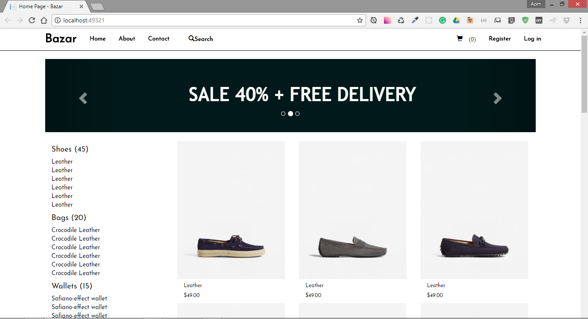
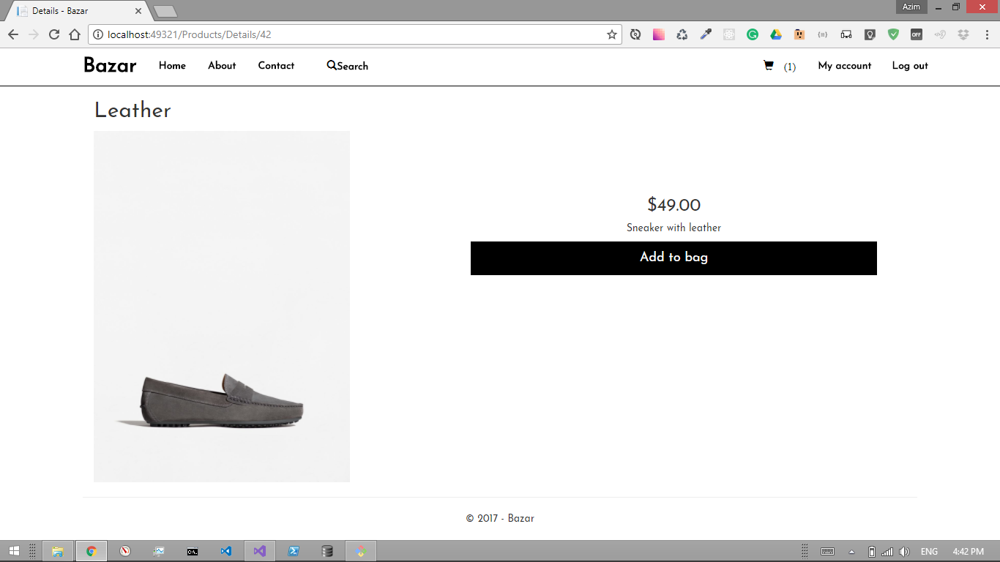
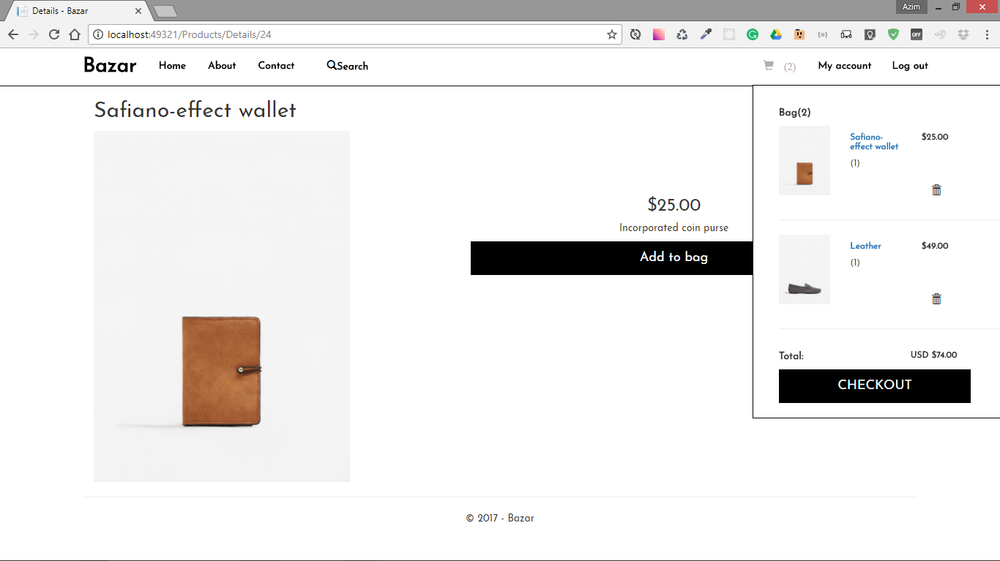

# Bazar! e-commerce web application

## About

Bazar is e-commerce platform for small leather production manufacturer to sell its products online and reach to as many people as possible within web. It was built on Microsoft .NET Core platform using SQL server for server side and Javascript and Bootstrap for client side of the application.

## To run this application:
1.  Clone this repo to a local directory
1.  `cd` to your local directory
1.  Open the `Bazar.sln` file in Visual Studio
1.  Using the Package Manager Console in Visual Studio, run `update-database`
1.  Run the program on your local host 

## Home Page Screenshot

## Product Details Pagee Screenshot

## Shopping Cart Pagee Screenshot

## Built With

The Bazar web application was built using: 

*  ASP.NET Core MVC and Identity Framework 
*  SQL Server for database
*  Javascript for clent side
*  [Bower](https://go.microsoft.com/fwlink/?LinkId=518004) for managing client-side libraries
*  Theming using [Bootstrap](https://go.microsoft.com/fwlink/?LinkID=398939)
*  [JS Hint](http://jshint.com/) - A tool that helps to detect errors and potential problems in your JavaScript code.
*  [JQuery](https://jquery.com/) - The Write Less, Do More, JavaScript Library.

    

